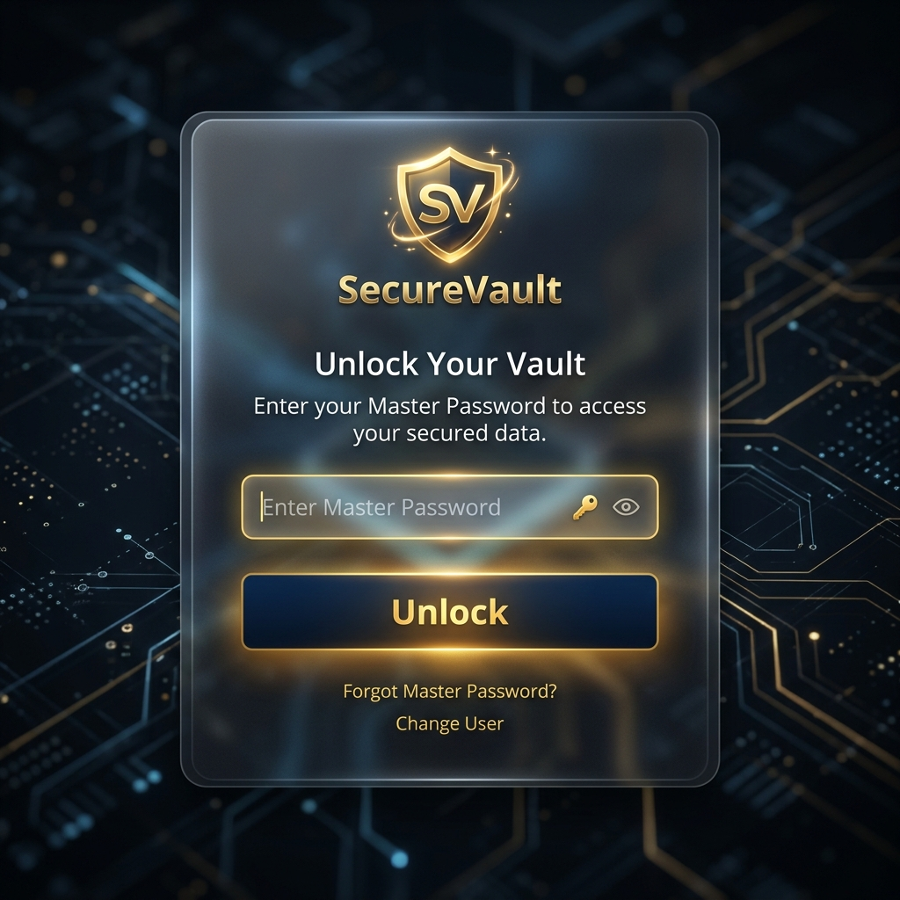
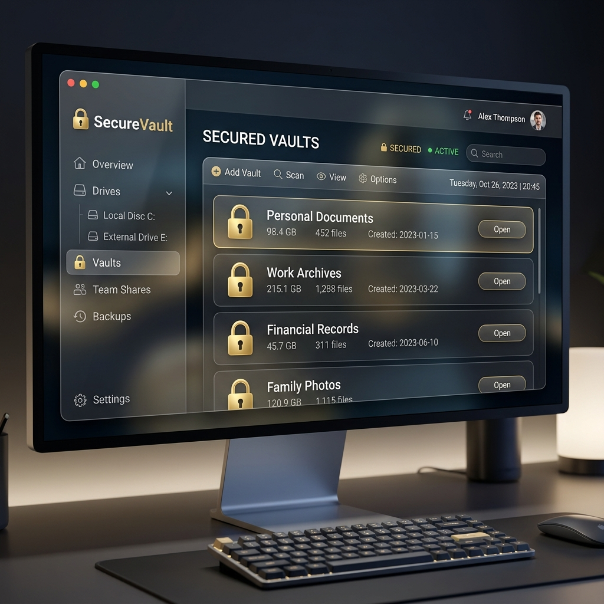

# 🔒 Secure Vault

**Secure Vault** is a premium, high-security desktop application designed to protect your sensitive folders with military-grade encryption, smart authentication, and automated defense mechanisms.




## ✨ Key Features

- **🛡️ Folder Locking**: Securely lock any folder on your system with a single click.
- **🔑 Multi-Factor Authentication**: Integrated SMTP-based OTP (One-Time Password) for secure password recovery.
- **🚀 Premium UI**: Modern glassmorphism design with a dark-themed, intuitive interface.
- **⚡ Smart Nuke**: Automated security trigger that backups and destroys sensitive data after multiple failed login attempts.
- **📂 Drive Detection**: Automatically detects removable drives and helps you manage vaults across different storages.

## 🛠️ Tech Stack

- **Language**: Python 3.x
- **GUI Framework**: CustomTkinter
- **Image Processing**: Pillow (PIL)
- **Security**: SHA-256 Hashing, XOR Obfuscation
- **Communication**: SMTP for encrypted email alerts and OTPs

## 🚀 Getting Started

### Prerequisites
- Python 3.8+
- pip

### Installation

1. **Clone the repository**:
   ```bash
   git clone https://github.com/rishilokesh111/Secure-Vault.git
   cd Secure-Vault
   ```

2. **Install dependencies**:
   ```bash
   pip install -r requirements.txt
   ```

3. **Run the application**:
   ```bash
   python main.py
   ```
4. **website - Downlode the .exe file from here**:
   '''bash
   https://securevaultdownlode.netlify.app/
   '''
   
## ⚙️ Configuration

Secure Vault uses encrypted configuration storage. For advanced SMTP settings:
1. Open the application.
2. Navigate to **Settings**.
3. Configure your Sender Email, App Password, and Receiver Email.

## 🤝 Contributing

Contributions are welcome! Please feel free to submit a Pull Request.

## 📄 License

This project is licensed under the MIT License - see the LICENSE file for details.
